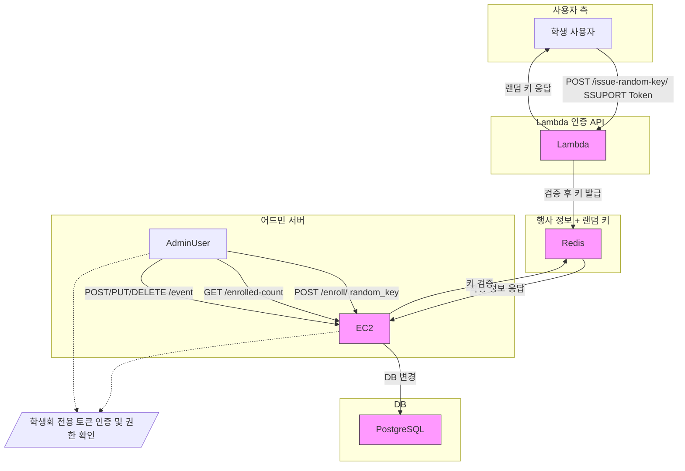

# PASSU API 설계 명세서

## 개요

이 문서는 PASSU 인증 시스템의 AWS 기반 아키텍처 및 API 설계를 설명합니다.

### 서비스 특성

PASSU는 다음과 같은 특수한 사용 패턴을 갖는 이벤트 등록 시스템입니다:

1. **트래픽 패턴**:

   - 이벤트 시작 시간에 매우 짧은 시간 내에 폭발적인 트래픽 발생
   - 피크 이후에는 요청이 거의 없는 극단적인 사용량 패턴
   - 대부분의 요청이 읽기(read) 작업으로 구성됨

2. **데이터 특성**:
   - 검증을 위한 정보(이벤트 정보)는 빈번히 조회되지만 거의 변경되지 않음
   - 학생별 인증 데이터는 짧은 시간 동안만 유효함

이러한 특성에 최적화하기 위해, PASSU는 서버리스 아키텍처와 캐싱 전략을 적극 활용한 3중 구조로 설계되었습니다:

1. **검증 람다 (Validation Lambda)**: 일반 사용자에게 노출되는 유일한 API로, 오토스케일링을 통해 폭발적 트래픽에 대응
2. **캐시 서버 (Cache Instance)**: 발급된 랜덤키와 이벤트 정보를 저장하여 빠른 응답 속도 보장
3. **어드민 서버 (Admin Instance)**: 데이터베이스에 직접 연결되는 유일한 인스턴스로 보안 강화 및 관리 기능 담당

모든 사용자 API는 API Gateway를 통해 제공되며, 인증은 SSUPORT 토큰을 활용합니다.

## 데이터베이스 구조

스프레드시트 대신 PostgreSQL과 같은 관계형 데이터베이스를 사용하여 데이터를 저장합니다:

1. **타임스태프 관리를 위한 트리거 함수**

   ```sql
   -- 자동 타임스태프 관리를 위한 함수 생성
   CREATE OR REPLACE FUNCTION update_timestamp()
   RETURNS TRIGGER AS $$
   BEGIN
     NEW.updated_at = CURRENT_TIMESTAMP;
     RETURN NEW;
   END;
   $$ LANGUAGE plpgsql;

   -- 상태 관리를 위한 ENUM 타입 생성
   CREATE TYPE enrollment_status AS ENUM ('active', 'deactive');
   ```

2. **events 테이블**

   ```sql
   CREATE TABLE events (
     id SERIAL PRIMARY KEY,
     name VARCHAR(255) NOT NULL,
     description TEXT,

     -- 상품 정보
     product_name VARCHAR(255) NOT NULL,
     total_quantity INTEGER NOT NULL,

     -- 조건 필드
     require_enrolled BOOLEAN DEFAULT TRUE,       -- 재학생 여부
     require_union_fee BOOLEAN DEFAULT TRUE,      -- 학생회비 납부 여부
     allowed_departments VARCHAR[] DEFAULT '{}',  -- 허용된 학과 목록 (비어있으면 전체 허용)

     event_open_at TIMESTAMP NOT NULL,

     created_at TIMESTAMP DEFAULT CURRENT_TIMESTAMP,
     updated_at TIMESTAMP DEFAULT CURRENT_TIMESTAMP
   );

   -- events 테이블에 타임스태프 업데이트 트리거 적용
   CREATE TRIGGER update_events_timestamp
   BEFORE UPDATE ON events
   FOR EACH ROW
   EXECUTE FUNCTION update_timestamp();
   ```

3. **enrollments 테이블**

   ```sql
   CREATE TABLE enrollments (
     id SERIAL PRIMARY KEY,
     event_id INTEGER REFERENCES events(id),
     student_id VARCHAR(50) NOT NULL,
     student_name VARCHAR(100) NOT NULL,
     student_department VARCHAR(100) NOT NULL,
     random_key INTEGER NOT NULL,
     timestamp TIMESTAMP DEFAULT CURRENT_TIMESTAMP,
     status enrollment_status DEFAULT 'active',
     created_at TIMESTAMP DEFAULT CURRENT_TIMESTAMP,
     updated_at TIMESTAMP DEFAULT CURRENT_TIMESTAMP,
     UNIQUE (event_id, student_id),
     UNIQUE (event_id, random_key),
     CHECK (random_key BETWEEN 1000 AND 9999)
   );

   -- enrollments 테이블에 타임스태프 업데이트 트리거 적용
   CREATE TRIGGER update_enrollments_timestamp
   BEFORE UPDATE ON enrollments
   FOR EACH ROW
   EXECUTE FUNCTION update_timestamp();

   -- 조회 패턴에 맞는 인덱스 전략
   -- 1. 가장 중요한 복합 인덱스: event_id + random_key 조합으로 조회할 때 사용
   CREATE INDEX idx_enrollments_event_random ON enrollments(event_id, random_key);

   -- 학생 ID 기반 조회를 위한 인덱스
   CREATE INDEX idx_enrollments_student_id ON enrollments(student_id);
   ```

4. **Redis** (임시 데이터 저장)
   - 키 형식: `event:{event_id}:random_key:{random_key}`
   - 값: 학생 정보 및 이벤트 등록 데이터
   - TTL: 15분

## API 명세

### Lambda로 구현되는 사용자 API

### 1. 랜덤 키 발급 API

- **기능**: 학생에게 고유한 랜덤 키 발급
  - **내부 검증 로직**:
    1. 학생 토큰을 통해 SSUPORT에서 학생 정보 가져오기
    2. 학생 정보와 이벤트 참여 조건 비교 검증 (전공, 학년 등)
    3. 모든 검증 통과 시 새로운 랜덤 키 생성 (기존 키가 있더라도 항상 새 키 발급)
    4. Redis에 학생 정보와 랜덤 키 저장 (15분 TTL 적용)
- **URL**: `/api/v1/event/{event_id}/issue_random_key`
- **메소드**: POST
- **요청 헤더**:
  - `Authorization`: Bearer 토큰 형식의 학생 인증 토큰
- **응답**:
  - 성공 (200 OK):
    ```json
    {
      "isSuccess": true,
      "message": "Random key issued successfully",
      "random_key": "string",
      "expired_at": "ISO8601 timestamp"
    }
    ```
  - 실패 (400 Bad Request):
    ```json
    {
      "isSuccess": false,
      "message": "Student is not eligible for this event",
      "detail": "Student major does not match event requirements"
    }
    ```
  - 실패 (401 Unauthorized):
    ```json
    {
      "isSuccess": false,
      "message": "Invalid token"
    }
    ```
  - 실패 (500 Internal Server Error):
    ```json
    {
      "isSuccess": false,
      "message": "Internal server error",
      "detail": "Error message"
    }
    ```

## 어드민 서버(EC2)로 구현되는 관리자 API

### 1. 학생 등록 API

- **기능**: 랜덤 키를 사용하여 학생을 이벤트에 등록
  - **내부 처리 로직**:
    1. 학생회 권한 확인: 토큰을 통해 학생회 권한을 가진 사용자인지 검증
    2. 랜덤 키 유효성 확인: 입력된 랜덤 키와 이벤트 ID에 해당하는 데이터가 Redis에 존재하는지 확인
    3. 중복 등록 검증: 해당 랜덤 키와 연결된 학생이 이미 DB에 등록되어 있는지 확인
    4. DB 등록: 검증 통과 시 Redis에서 정보를 가져와 PostgreSQL의 enrollments 테이블에 영구 저장
    5. Redis 키 삭제: 등록 완료 후 Redis에서 해당 랜덤 키 삭제
- **URL**: `/api/v1/event/{event_id}/enroll`
- **메소드**: POST
- **요청 헤더**:
  - `Authorization`: Bearer 토큰 형식의 학생 인증 토큰
- **요청 본문**:
  ```json
  {
    "random_key": "string"
  }
  ```
- **응답**:
  - 성공 (201 Created):
    ```json
    {
      "isSuccess": true,
      "message": "Student enrolled successfully",
      "event_id": "string",
      "student_id": "string",
      "enrollment_id": "string",
      "timestamp": "ISO8601 timestamp (enrolled time)"
    }
    ```
  - 실패 (400 Bad Request):
    ```json
    {
      "isSuccess": false,
      "message": "Invalid random key",
      "detail": "Random key not found or expired"
    }
    ```
  - 실패 (401 Unauthorized):
    ```json
    {
      "isSuccess": false,
      "message": "Authentication failed",
      "detail": "Only student council can call this API"
    }
    ```
  - 실패 (409 Conflict):
    ```json
    {
      "isSuccess": false,
      "message": "Student already enrolled",
      "detail": "This student is already enrolled in this event"
    }
    ```
  - 실패 (404 Not Found):
    ```json
    {
      "isSuccess": false,
      "message": "Resource not found",
      "detail": "Random key not found"
    }
    ```

### 2. 등록 학생 수 조회 API

- **기능**: 특정 이벤트에 등록된 학생 수 반환
- **URL**: `/api/v1/event/{event_id}/enrolled_count`
- **메소드**: GET
- **응답**:
  - 성공 (200 OK):
    ```json
    {
      "count": integer
    }
    ```
  - 실패 (404 Not Found):
    ```json
    {
      "error": "Event not found"
    }
    ```
  - 실패 (500 Internal Server Error):
    ```json
    {
      "error": "Error message"
    }
    ```

### 3. 이벤트 관리 API

- **기능**: 이벤트 생성, 수정, 삭제
- **URL**: `/api/v1/event`
- **메소드**: POST, PUT, DELETE
- **요청 헤더**:
  - `Authorization`: Bearer 토큰 형식의 학생회 인증 토큰
- **요청 본문** (POST, PUT):
  ```json
  {
    "name": "string",
    "description": "string",
    "conditions": {
      "major": ["string"],
      "year": ["string"],
      "other_criteria": "any"
    }
  }
  ```
- **응답**:
  - 성공 (200/201 OK/Created):
    ```json
    {
      "event_id": "string",
      "name": "string",
      "description": "string",
      "conditions": {},
      "created_at": "ISO8601 timestamp"
    }
    ```
  - 실패 (401 Unauthorized):
    ```json
    {
      "error": "Only student council can call this API"
    }
    ```

### 4. 이벤트 리스트 조회 API

- **기능**: 종료된 이벤트, 현재 진행 중인 리스트 조회
- **URL**: `/api/v1/event`
- **메소드**: GET
- **요청 헤더**:

  - `Authorization`: Bearer 토큰 형식의 학생회 인증 토큰

- **응답**:

  - 성공 (200/201 OK/Created):

    ```json
    {
     "ended_events" : [
      {
        "event_id" : "String",
        "name": "String",
        "created_at": "",
        "semester": ""
      },
     ],

     "upcomming_evnets" : [
      {
        {
        "event_id" : "String",
        "name": "String",
        "created_at": "",
        "semester": ""
        },
      }
     ]
    }
    ```

  - 실패 (401 Unauthorized):
    ```json
    {
      "error": "Only student council can call this API"
    }
    ```

### 5. 이벤트 디테일 조회 API

- **기능**: 종료된 이벤트, 현재 진행 중인 리스트 조회
- **URL**: `/api/v1/event/{event_id}`
- **메소드**: GET
- **요청 헤더**:

  - `Authorization`: Bearer 토큰 형식의 학생회 인증 토큰

- **응답**:
  - 성공 (200/201 OK/Created):
    ```json
    {
      "event_id": "string",
      "name": "string",
      "description": "string",
      "conditions": {},
      "created_at": "ISO8601 timestamp"
    }
    ```
  - 실패 (401 Unauthorized):
    ```json
    {
      "error": "Only student council can call this API"
    }
    ```

### 6. 이벤트에 등록된 사람들 조회 API

- **기능**: 종료된 이벤트, 현재 진행 중인 리스트 조회
- **URL**: `/api/v1/event/{event_id}/enrolled_list`
- **메소드**: GET
- **요청 헤더**:

  - `Authorization`: Bearer 토큰 형식의 학생회 인증 토큰

- **응답**:
  - 성공 (200/201 OK/Created):
    ```json
    {
      [
        {
          "id" : "",
          "name": "",
          "student_id": "",
          "major_code": "",
          "member_code": "",
        },
      ]
    }
    ```
  - 실패 (401 Unauthorized):
    ```json
    {
      "error": "Only student council can call this API"
    }
    ```

## 아키텍처

### Lambda 함수 (사용자 API)

**IssueRandomKeyFunction**

- 경로: `/api/v1/event/{event_id}/issue_random_key`
- 트리거: API Gateway
- 설명: 학생에게 랜덤 키를 발급하는 핵심 기능으로, 자동 확장성이 필요하여 Lambda로 구현

### 어드민 서버 (EC2, 관리자 API)

**EnrollStudentAPI**

- 경로: `/api/v1/event/{event_id}/enroll`
- 설명: 학생회가 랜덤 키를 확인하고 학생을 이벤트에 등록하는 기능, 보안 및 안정성을 위해 서버로 구현

**EnrolledCountAPI**

- 경로: `/api/v1/event/{event_id}/enrolled_count`
- 설명: 현재 이벤트에 등록된 학생 수를 조회하는 기능

**EventManagementAPI**

- 경로: `/api/v1/event`
- 설명: 이벤트 생성, 수정, 삭제 등 관리 기능

## 공통 레이어

Lambda 함수 간에 공유되는, 재사용 가능한 코드는 Lambda 레이어로 구현됩니다:

1. **SSUPortLayer**: SSUPORT API와 통신하는 코드 (내부 함수로만 사용됩니다)
2. **DatabaseLayer**: PostgreSQL 및 Redis 접근 로직
3. **AuthLayer**: 인증 및 권한 검증 로직
4. **UtilsLayer**: 로깅, 에러 핸들링 등 유틸리티 함수

## 보안 및 인증

- 모든 API는 API Gateway를 통해 HTTPS로 제공됩니다.
- 학생 인증은 SSUPORT 토큰을 통해 이루어집니다.
- 학생회 권한이 필요한 API는 토큰 확인 후 is_council 속성을 검증합니다.

## 모니터링 및 로깅

- CloudWatch Logs를 사용하여 모든 Lambda 함수의 로그 저장
- X-Ray를 통한 트레이싱
- CloudWatch Alarms를 사용한 오류 모니터링 및 알림


